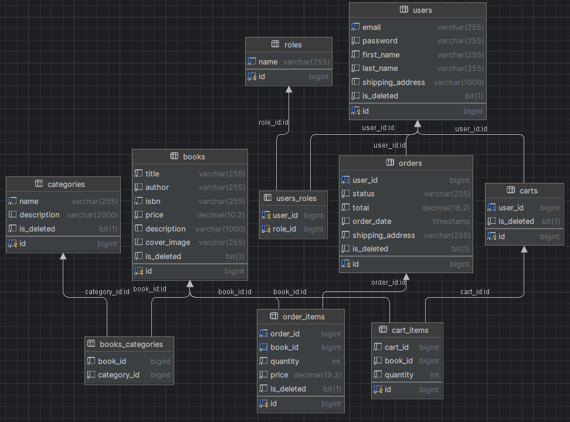

# Online Book Store

## Project Overview

The online bookstore management system offers a user-friendly interface for customers and administrators while ensuring security through authentication and authorization using JWT tokens. Customers can easily sign up, browse books, manage their shopping carts, place orders, and review their order history. Administrators, on the other hand, have tools to efficiently handle the book catalog, categories, and monitor order statuses. The project's aim is to create a convenient API that enhances the online book purchasing experience and simplifies administrative tasks.

- **User**: Contains registered user information, including authentication details and personal information.
- **Role**: Represents user roles within the system, such as admin or regular user.
- **Book**: Represents books available in the store.
- **Category**: Represents book categories.
- **ShoppingCart**: Represents a user's shopping cart.
- **CartItem**: Represents items in a user's shopping cart.
- **Order**: Represents orders placed by users.
- **OrderItem**: Represents items in a user's order.

### Shopper (User)
- Looks at books, adds them to the shopping cart, and makes purchases.

### Manager (Admin)
- Arranges books on the shelf and oversees purchases.

## Functionalities

### For Shoppers
- **Join and sign in**: Register and sign in to access books and make purchases.
- **View and search for books**: Browse books, search by name, view details.
- **Explore bookshelf sections**: Access book categories and view books within each section.
- **Use the shopping cart**: Add, view, and remove items.
- **Purchase books**: Buy items in the shopping cart.
- **View past receipts**: Review previous purchase details.

### For Managers
- **Arrange books**: Add, modify, or remove books from the store.
- **Organize bookshelf sections**: Create, update, or remove book categories.
- **Manage receipts**: Update receipt statuses (e.g., "Shipped" or "Delivered").

# Technologies Used

- **Spring Boot v3.1.4:** Utilized as the primary framework for building the application.
- **Spring Security v6.1.5:** Implemented for authentication and authorization management using JWT token.
- **Java version 17:** Chosen as the main programming language.
- **Database Management:** MySQL 8.0.33, Hibernate as main ORM framework, Liquibase v4.20.0
- **Spring Data JPA:** Utilized for simplified data access and manipulation.
- **Deployment and Cloud Services:** Docker 3.8, AWS
- **Testing:** JUnit 5, Mockito
- **Maven:** Relied on for project management and build automation.
- **Additional instruments:** Lombok, Mapstruct
- **Documentation:** Swagger

# Database structure:
\

---

# Project controllers with the following endpoints:

---

## **Authentication Controller:**

| **HTTP method** | **Endpoint**  | **Role** | **Function** |
|:----------------:|:--------------:|:--------:|:-------------|
| POST | /register | ALL | Allows users to register a new account. |
| POST | /login | ALL | Get JWT tokens for authentication. |

---

## **Book Controller:** _Searching for books (CRUD for books)_

| **HTTP method** | **Endpoint**  | **Role** | **Function**                       |
|:---------------:|:-------------:|:--------:|:-----------------------------------|
|       GET       |    /books     |   USER   | Endpoints for managing books.      |
|       GET       |  /books/{id}  |   USER   | Search for a specific book by id.  |
|       PUT       | /{books}/{id} |  ADMIN   | Allows admin to update book by id. |
|      POST       |   /{books}    |  ADMIN   | Allows admin to create new book.   |
|     DELETE      | /{books}/{id} |  ADMIN   | Allows admin to delete book.       |

---

## **Category Controller:** _Managing category (CRUD for Categories)_

| **HTTP method** |   **Endpoint**    | **Role** | **Function**                          |
|:--------------:|:-----------------:|:--------:|:--------------------------------------|
|      POST      |     /category     |  ADMIN   | Allow admin to create a new category. |
|       GET      |     /category     |   USER   | Get all categories from DB.           |
|       GET      |  /category/{id}   |   USER   | Get category by id from DB.           |
|       PUT      |  /category/{id}   |  ADMIN   | Update category by id.                |
|    DELETE      |  /category/{id}   |  ADMIN   | Allow admin delete some category.     |

---

## **Cart Controller:** _User cart management_

| **HTTP method** |    **Endpoint**     | **Role** | **Function**                                   |
|:---------------:|:-------------------:|:--------:|:-----------------------------------------------|
|       GET       |        /cart        |   USER   | Get cart from logged user from DB.             |
|      POST       |        /cart        |   USER   | Add books to the user cart".                   |
|     DELETE      |  /cart-items/{id}   |   USER   | Delete cart item from the user cart.           |
|       PUT       |  /cart-items/{id}   |   USER   | Update quantity of cart item in the user cart. |

---

## **Order Controller:** _Managing orders_

| **HTTP method** |           **Endpoint**           | **Role** | **Function**                         |
|:--------------:|:--------------------------------:|:--------:|:-------------------------------------|
|      POST      |             /orders              |   USER   | Allow user to make new order.        |
|       PUT      |        /orders/{orderId}         |  ADMIN   | Allows admin to update order status. |
|       GET      |             /orders              |   USER   | Get order history.                   |
|       GET      | /orders/{orderId}/items/{itemId} |   USER   | Get item from order.                 |
|       GET      |     /orders/{orderId}/items      |   USER   | Get all items from order.            |

---

## Project Setup

To set up the project locally, follow these steps:
1. Clone the repository: `git clone https://github.com/don-bigdad/SpringBoot-Book-Shop.git`
2. Navigate to the project directory: `cd SpringBoot-Book-Shop`
3. Build the project using Maven: `mvn clean install`
4. Run the application: `mvn spring-boot:run`
## Contact

For additional information or inquiries, please contact:
- Email: bohdan.maksymenko.jv@gmail.com
- [Telegram](https://t.me/Blgdad)
- [LinkedIn](https://www.linkedin.com/in/bohdan-maksymenko-2a4aa2292/)
